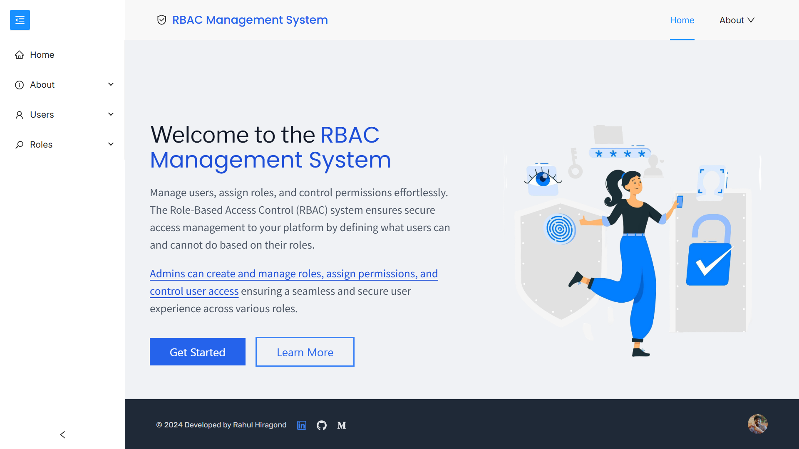
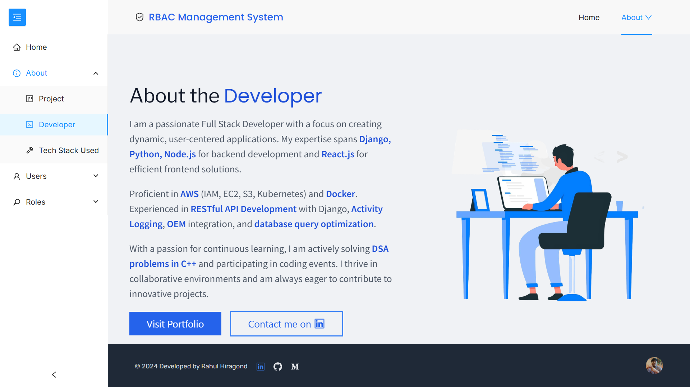
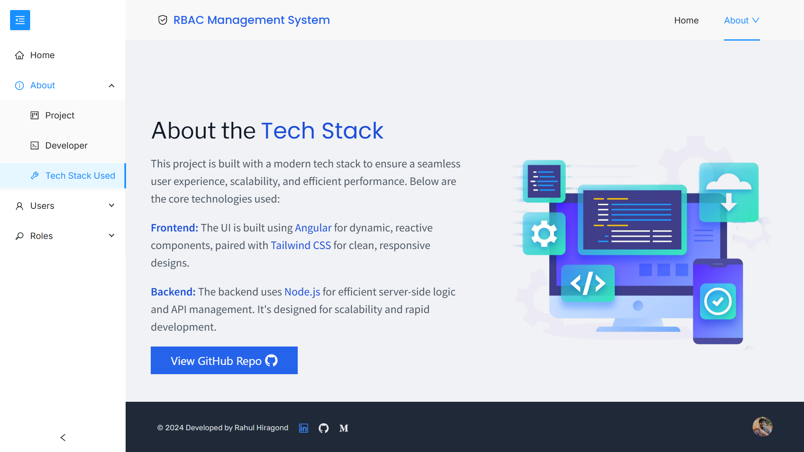
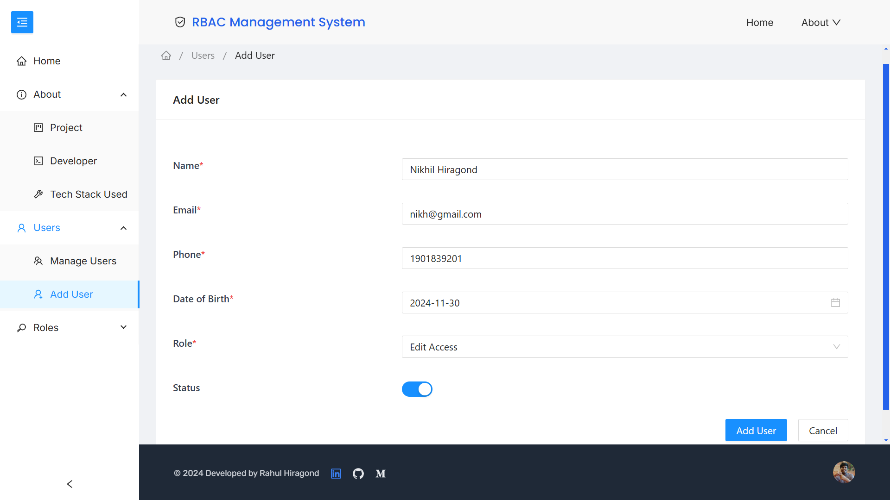
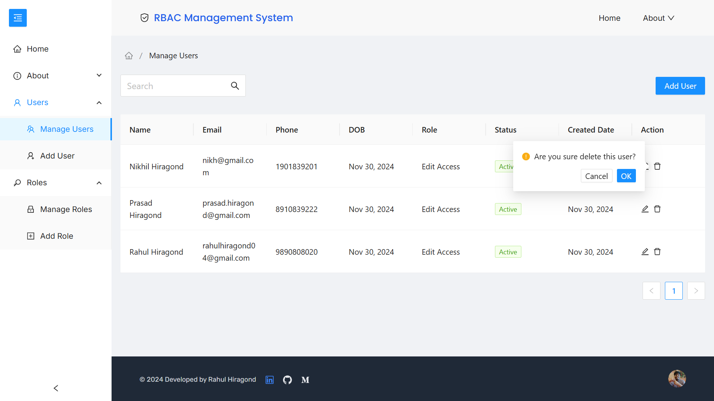
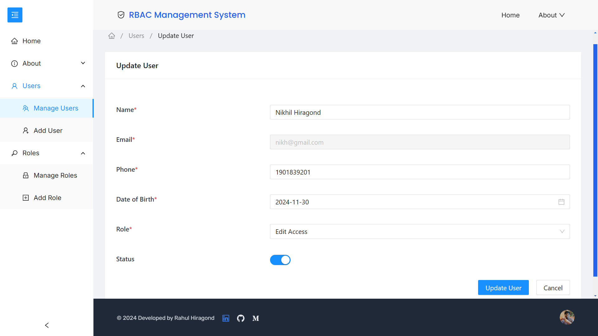
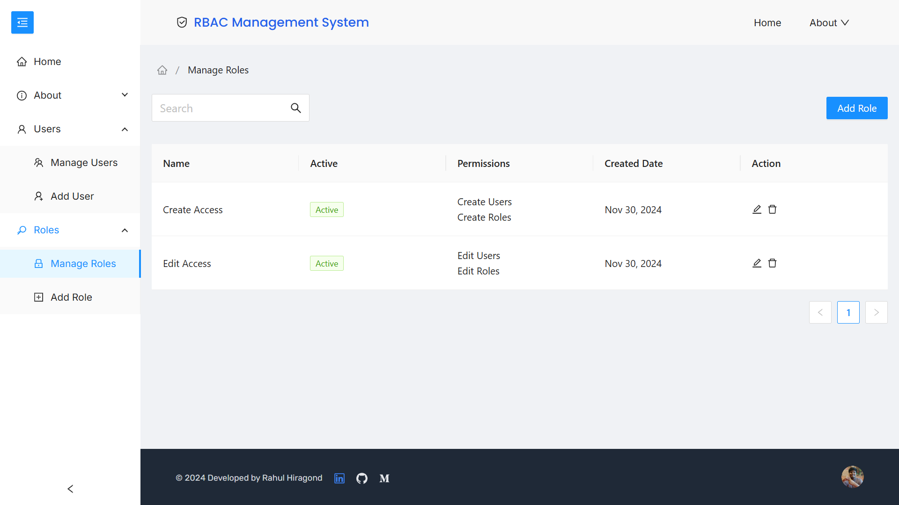
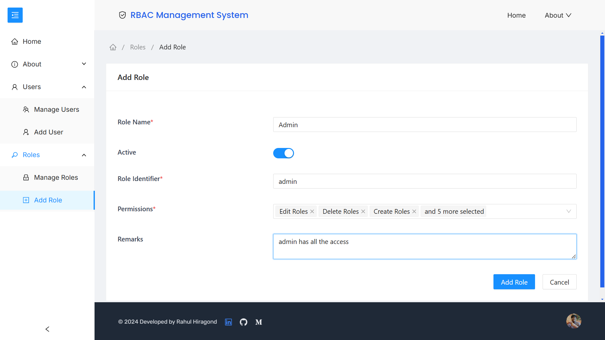

<h1 align="center" id="title" style="margin-bottom: 1rem">rbac-frontend</h1>

<p align="center"></p>

<p id="description">The RBAC Management System is a comprehensive role-based access control (RBAC) application that enables administrators to manage user's roles and permissions in a secure and efficient way. The platform is built using Angular and utilizes Ng-Zorro for UI components and Tailwind CSS for responsive design. This system ensures secure access management and is highly customizable for various user roles and permissions.</p>

<h2 style="margin-bottom: 0.5rem">Deployment Link 📦</h2>

🌐 **Explore it here**: [https://rbac-mohitjaiswal.netlify.app](https://rbac-mohitjaiswal.netlify.app)

<h2 style="margin-bottom: 0.5rem">Features 🔥</h2>

Here are some of the project's best features:

- User Management: View create edit and delete users and manage their roles and permissions.

- Role Management: Create edit and delete roles and assign specific permissions.

- Permission Management: Define and assign granular permissions to users and roles.

- Seamless Navigation: Smooth navigation with Lazy Loading for modules and Route Guards for access control.

- Integrated: Already integrated with a backend system for dynamic user/role management.

- User-Friendly Interface: Modern UI with Ng-Zorro and custom components for a sleek experience.

<h2 style="margin-bottom: 0.5rem">Built with 🚀</h2>

Technologies used in the project:

- Frontend: Angular 16 Tailwind CSS Ng-Zorro

- Routing: Angular Router with Lazy Loading

- Build Tools: Webpack Angular CLI

- CI/CD: GitHub Actions (for deployment automation)

- Version Control: Git GitHub

- Backend: Node.js and Express.js

- Database: MongoDB

<h2 style="margin-bottom: 0.5rem">Install and Run ⚙️</h2>

I. Prerequisites:

- Node.js (>= 16.x.x)
- npm (>= 8.x.x)

II. Clone the repository:

```bash
  git clone https://github.com/mohitjaiswal28/rbac-frontend
  cd rbac-management-system
```

III. Install dependencies:

```bash
  npm install
```

IV. Run the development server:

```bash
  npm start
```

V. This will start the application on http://localhost:4200.

<h2 style="margin-bottom: 0.5rem">Project Structure 📁</h2>

```
src/
├── app/
│   ├── core/
│   ├── shared/
│   ├── home/
│   ├── role/
│   │   ├── role.add/
│   │   └── role.manage/
│   ├── user/
│   │   ├── user.add/
│   │   └── user.manage/
│   ├── app-routing.module.ts
│   ├── app.component.ts
│   └── app.module.ts
├── assets/
├── environments/
├── styles/
├── index.html
└── main.ts
```

<h2 style="margin-bottom: 0.5rem">Screenshots ✅</h2>

- Home Page



- About Project


- About Developer



- About Tech Stack Used



- User Functionalities






- Role Functionalities




<h2 style="margin-bottom: 0.5rem">Contact 💡</h2> 
For inquiries, please reach out to:
<br>
Mohit Jaiswal: mohitjaiswal2883@gmail.com ✉️
